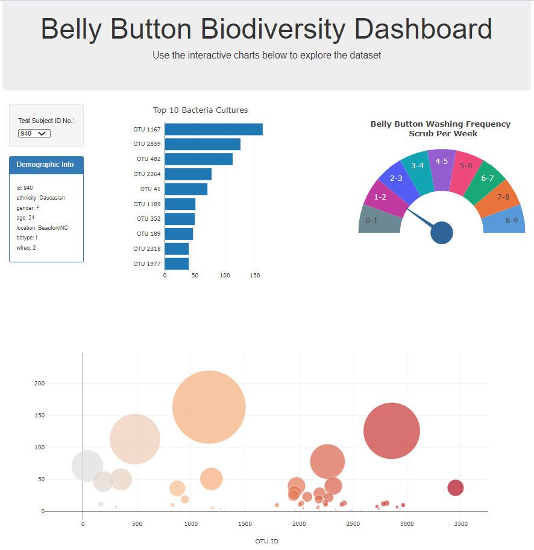

# Plotly_Homework_Belly_Button_Biodiversity
#### Plotly_Homework_Belly_Button_Biodiversity due on 08/02/2021

This project contains an interactive dashboard to explore the Belly Button Biodiversity DataSet for each sample.  The D3 libary 
is used to read the samples.json file and to create the following: a horizontal bar chart (with the top 10 OTU's), a bubble chart that displays each sample size, 
and a gauge chart displaying the frequency of scrubs per week.

  
##### To view the dash board in Git Hub Pages:
https://lcswsher.github.io/Plotly_Homework_Belly_Button_Biodiversity/

